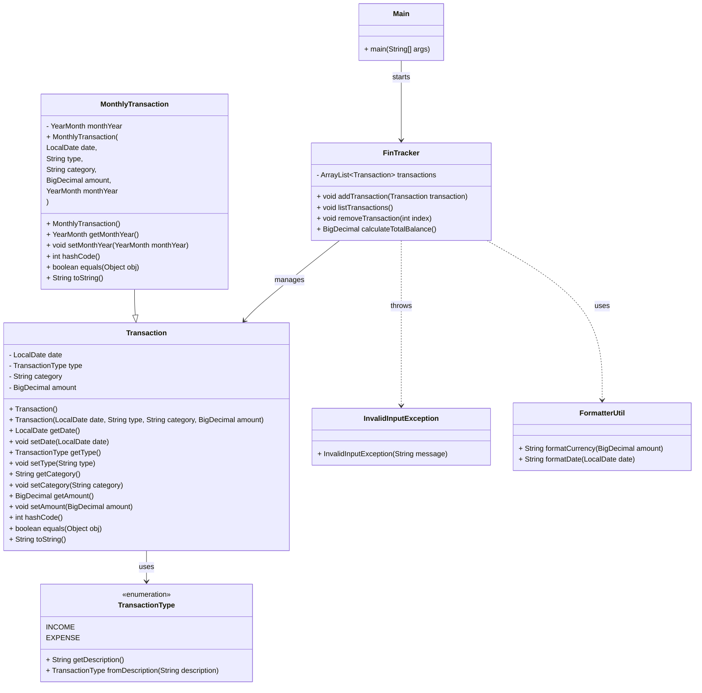

# Projeto: FinTrack

## Descrição do Projeto (Versão Inicial)
O FinTrack é um sistema de controle de finanças pessoais via console, permitindo ao usuário:

* Cadastrar entradas (receitas) e saídas (despesas)
* Listar todas as transações
* Exibir saldo atual
* Remover uma transação

O projeto será feito com Java puro, com foco na prática de POO e estruturas básicas, e poderá ser expandido futuramente com relatórios gráficos, persistência em banco de dados e integração com APIs.

## Diagrama de Classes



## Organização dos Arquivos

O projeto possui a seguinte estrutura de diretórios e arquivos:

```bash
├── app
│   ├── controller
│   │   ├── FinTracker.class
│   │   └── FinTracker.java
│   ├── exceptions
│   │   ├── InvalidInputException.class
│   │   └── InvalidInputException.java
│   ├── Main.class
│   ├── Main.java
│   ├── model
│   │   ├── MonthlyTransaction.class
│   │   ├── MonthlyTransaction.java
│   │   ├── Transaction.class
│   │   └── Transaction.java
│   └── utils
│       ├── Formatter.class
│       └── Formatter.java
├── docs
│   ├── SCRIPTS.md
│   └── TEST_SCRIPT.md
└── README.md
```

## Comandos para Execução

[Link para os comandos de execução](./docs/SCRIPTS.md)

## Roteiro Prático de Teste

[Link para os testes](./docs/TEST_SCRIPT.md)
